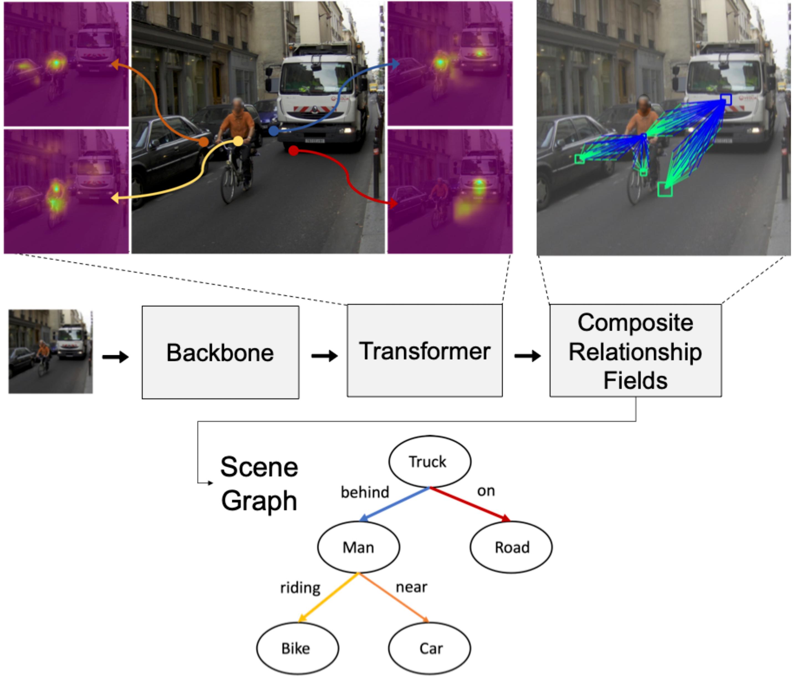
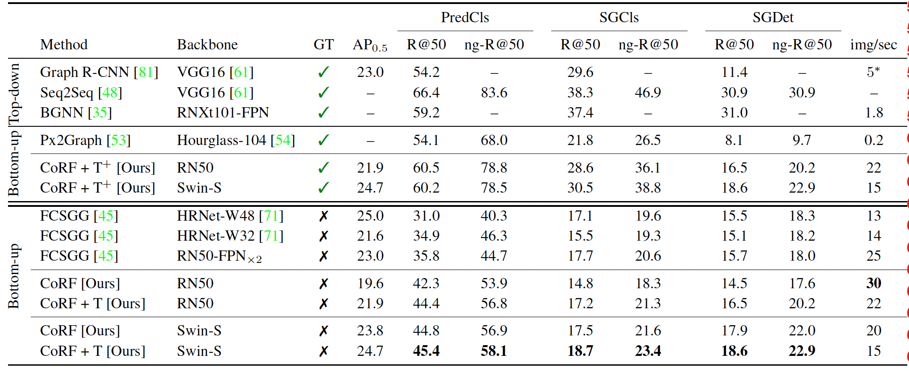

# Composite Relationship Fields with Transformers for Scene Graph Generation

This codebase is the official implementation of "Composite Relationship Fields with Transformers for Scene Graph Generation" (Accepted at WACV2023).



> Scene graph generation (SGG) methods aim to extract a structured semantic
> representation of a scene by detecting the objects present and their relationships.
> While most methods focus on improving top-down approaches, which build a scene
> graph based on predicted objects from an off-the-shelf object detector, there
> is a limited amount of work on bottom-up approaches, which directly predict
> objects and their relationships in a single stage.

> In this work, we present a novel bottom-up SGG approach by representing relationships
> using *Composite Relationship Fields* (CoRF). CoRF turns relationship
> detection into a dense regression and classification task, where each cell of
> the output feature map identifies surrounding objects and their relationships.
> Furthermore, we propose a refinement head that leverages Transformers for global
> scene reasoning, resulting in more meaningful relationship predictions. By combining
> both contributions, our method outperforms previous bottom-up methods on the
> Visual Genome dataset by 26\% while preserving real-time performance.

## Requirements

This codebase is based on the publicly-available repository [openpifpaf/openpifpaf](https://github.com/openpifpaf/openpifpaf). We modify certain files from OpenPifPaf and add other parts as plugins. We also include a modified version of [apex](https://github.com/NVIDIA/apex) that [Scene-Graph-Benchmark.pytorch](https://github.com/KaihuaTang/Scene-Graph-Benchmark.pytorch) relies on for evaluation. The main dependencies of this codebase are:

* Python 3.8.5
* [Apex](https://github.com/NVIDIA/apex)
* [Openpifpaf](https://github.com/openpifpaf/openpifpaf)
* [Scene-Graph-Benchmark.pytorch](https://github.com/KaihuaTang/Scene-Graph-Benchmark.pytorch)

We recommend before installing the requirements to create a virtual environment where all packages will be installed ([link](https://realpython.com/python-virtual-environments-a-primer/)).

First, make sure that inside the main folder (`SGG-CoRF`) you have the *openpifpaf* and *apex* folder. Activate the virtual environment (optional)

Then, install the requirements:

```setup

cd SGG-CoRF

pip install numpy Cython

cd openpifpaf

pip install --editable '.[dev,train,test]'

pip install tqdm h5py graphviz ninja yacs cython matplotlib tqdm opencv-python overrides timm


# Make sure to re-install the correct pytorch version for your GPU from https://pytorch.org/get-started/locally/

# install apex
cd ../apex
python setup.py install --cuda_ext --cpp_ext

# install PyTorch Detection
cd ../
git clone https://github.com/KaihuaTang/Scene-Graph-Benchmark.pytorch.git
cd Scene-Graph-Benchmark.pytorch

python setup.py build develop

cd ../openpifpaf

```

**Note**, when running the training or evaluation, if your code crashes because of an error related to torch_six.PY3, follow these steps:

```fixing
cd Scene-Graph-Benchmark.pytorch

vim maskrcnn_benchmark/utils/imports.py

# change the line torch_six.PY3 to torch_six.PY37

```

To perform the following steps, make sure to be in the main **openpifpaf** directory (`SGG-CoRF/openpifpaf`).

In order to train the model, the dataset needs to be downloaded and pre-processed:

1. Create a folder called `data` and inside it a folder called `visual_genome`
2. Download images from [Visual Genome](http://visualgenome.org/api/v0/api_home.html) (parts 1 and 2)
3. Place all images into `data/visual_genome/VG_100K/`
4. Create VG-SGG.h5, imdb_512.h5, imdb_1024.h5, VG-SGG-dicts.json by following [here](https://github.com/danfeiX/scene-graph-TF-release/tree/master/data_tools) and place them in `data/visual_genome/`. To create imdb_512.h5, you will need to change the 1024 to 512 in `create_imdb.sh`.

## Training

To train the model(s) in the paper, run these commands from the main **openpifpaf** directory:

To train a ResNet-50 model with the transformer modules:

```train

python -m openpifpaf.train --lr=1e-4 --lr-basenet=1e-5 --b-scale=10.0 \                                                                 
--epochs=60 --lr-decay 40 50 \                                                    
--batch-size=40 --weight-decay=1e-5 --basenet=resnet50 \              
--resnet-pool0-stride=2 --resnet-block5-dilation=2 \                                                                        
--vg-cn-upsample 1 --dataset vg --vg-cn-square-edge 512 --vg-cn-use-512 --vg-cn-group-deform --vg-cn-single-supervision \
--cf3-deform-use-transformer --adamw --vg-cn-single-head

```

To train a Swin-S model with the transformer module:

```train

python -m openpifpaf.train --lr=1e-4 --lr-basenet=1e-5 --b-scale=10.0 \                                                                 
--epochs=60 --lr-decay 40 50 \                                                    
--batch-size=40 --weight-decay=1e-5 --swin-use-fpn --basenet=swin_s \
--vg-cn-upsample 1 --dataset vg --vg-cn-square-edge 512 --vg-cn-use-512 --vg-cn-group-deform --vg-cn-single-supervision \
--cf3-deform-use-transformer --adamw --vg-cn-single-head

```

To train a ResNet-50 model without the transformer modules:

```train

python -m openpifpaf.train --lr=1e-4 --lr-basenet=1e-5 --b-scale=10.0 \
 --epochs=60 --lr-decay 40 50 \
 --batch-size=40 --weight-decay=1e-5 --basenet=resnet50 \
 --resnet-pool0-stride=2 --resnet-block5-dilation=2 \
 --vg-cn-upsample 1 --dataset vg --vg-cn-square-edge 512 --vg-cn-use-512 --vg-cn-group-deform --vg-cn-single-supervision \
 --cf3-deform-deep4-head --cf3-deform-bn --cntrnet-deform-bn --cntrnet-deform-deep4-head --adamw"

```

To train a Swin-S model without the transformer modules:

```train

python -m openpifpaf.train --lr=1e-4 --lr-basenet=1e-5 --b-scale=10.0 \
--epochs=60 --lr-decay 40 50 \
--batch-size=40 --weight-decay=1e-5 --swin-use-fpn --basenet=swin_s \
--vg-cn-upsample 1 --dataset vg --vg-cn-square-edge 512 --vg-cn-use-512 --vg-cn-group-deform --vg-cn-single-supervision \
--cf3-deform-deep4-head --cf3-deform-bn --cntrnet-deform-bn --cntrnet-deform-deep4-head --adamw"

```

To train a ResNet-50 model with the transformer modules with GT detection tokes as input (PredCls):

```train

python -m openpifpaf.train --lr=1e-4 --lr-basenet=1e-5 --b-scale=10.0 \
--epochs=60 --lr-decay 40 50 \
--batch-size=40 --weight-decay=1e-5 --basenet=resnet50 \
--resnet-pool0-stride=2 --resnet-block5-dilation=2 \
--vg-cn-upsample 1 --dataset vg --vg-cn-square-edge 512 --vg-cn-use-512 --vg-cn-group-deform --vg-cn-single-supervision \
--cf3-deform-use-transformer --adamw --vg-cn-single-head --cntrnet-deform-prior-token predcls --cf3-deform-prior-token prior_vect_detcls \
--cntrnet-deform-prior-offset rel_offset --cf3-deform-prior-offset rel_offset --vg-cn-pairwise

```

To train a ResNet-50 model with the transformer modules with GT detection tokes as input (SGCls):

```train

python -m openpifpaf.train --lr=1e-4 --lr-basenet=1e-5 --b-scale=10.0 \
--epochs=60 --lr-decay 40 50 \
--batch-size=40 --weight-decay=1e-5 --basenet=resnet50 \
--resnet-pool0-stride=2 --resnet-block5-dilation=2 \
--vg-cn-upsample 1 --dataset vg --vg-cn-square-edge 512 --vg-cn-use-512 --vg-cn-group-deform --vg-cn-single-supervision \
--cf3-deform-use-transformer --adamw --vg-cn-single-head --cntrnet-deform-prior-token sgcls --cf3-deform-prior-token prior_vect_det \
--cntrnet-deform-prior-offset rel_offset --cf3-deform-prior-offset rel_offset --vg-cn-pairwise

```

To train a Swin-S model with the transformer modules with GT detection tokes as input (PredCls):

```train

python -m openpifpaf.train --lr=1e-4 --lr-basenet=1e-5 --b-scale=10.0 \
--epochs=60 --lr-decay 40 50 \
--batch-size=40 --weight-decay=1e-5 --swin-use-fpn --basenet=swin_s \
--vg-cn-upsample 1 --dataset vg --vg-cn-square-edge 512 --vg-cn-use-512 --vg-cn-group-deform --vg-cn-single-supervision \
--cf3-deform-use-transformer --adamw --vg-cn-single-head --cntrnet-deform-prior-token predcls --cf3-deform-prior-token prior_vect_detcls \
--cntrnet-deform-prior-offset rel_offset --cf3-deform-prior-offset rel_offset --vg-cn-pairwise

```

To train a Swin-S model with the transformer modules with GT detection tokes as input (SGCls):

```train

python -m openpifpaf.train --lr=1e-4 --lr-basenet=1e-5 --b-scale=10.0 \
--epochs=60 --lr-decay 40 50 \
--batch-size=40 --weight-decay=1e-5 --swin-use-fpn --basenet=swin_s \
--vg-cn-upsample 1 --dataset vg --vg-cn-square-edge 512 --vg-cn-use-512 --vg-cn-group-deform --vg-cn-single-supervision \
--cf3-deform-use-transformer --adamw --vg-cn-single-head --cntrnet-deform-prior-token sgcls --cf3-deform-prior-token prior_vect_det \
--cntrnet-deform-prior-offset rel_offset --cf3-deform-prior-offset rel_offset --vg-cn-pairwise

```


**Note**, to perform distributed training on multiple GPUs, as mentioned in the paper, add the following argument `--ddp` after `openpifpaf.train` in the commands above.

## Pre-trained Models

You can download the pretrained models from here:

- [Pretrained ResNet-50 Model with transformers](https://drive.google.com/file/d/1kGJ0Ik1goLDTKz4t4sNNQgKgF3P7860z/view?usp=sharing) trained on Visual Genome.
- [Pretrained ResNet-50 Model without transformers](https://drive.google.com/file/d/1dtmtoJlZB5ZHs-vsbXmNo4l4fXXpQmTb/view?usp=sharing) trained on Visual Genome.
- [Pretrained Swin-S Model with transformers](https://drive.google.com/file/d/1F0TmrxT4gfl23EDTOzJ-DkAQmcL0cRR-/view?usp=sharing) trained on Visual Genome.
- [Pretrained Swin-S Model without transformers](https://drive.google.com/file/d/1KAFz8cmI_rIpz74S-XOYumuSr4OUQs3j/view?usp=sharing) trained on Visual Genome.

Models with GT detection tokens as input:
- [Pretrained ResNet-50 Model with transformers (for PredCls)](https://drive.google.com/file/d/193pp7PNugaKRH_qRo-DO3vd0NjS97kw9/view?usp=sharing) trained on Visual Genome.
- [Pretrained ResNet-50 Model with transformers (for SGCls)](https://drive.google.com/file/d/1h3FafO_nVyReSPyHeJrR88qQC5UV0o9O/view?usp=sharing) trained on Visual Genome.
- [Pretrained Swin-S Model with transformers (for PredCls)](https://drive.google.com/file/d/1jB-7bfU2nhwXbWshJMAxVLyrofOtuVsL/view?usp=sharing) trained on Visual Genome.
- [Pretrained Swin-S Model with transformers (for SGCls)](https://drive.google.com/file/d/1s2CGnb-BrLaKJrArS_lB8x349n99Gt4g/view?usp=sharing) trained on Visual Genome.

Then follow these steps:

1. Create the folder `outputs` inside the main **openpifpaf** directory (if necessary)
2. Place the downloaded models inside the `outputs` folder

These models will produce the results reported in the paper.

## Evaluation

To evaluate the model on Visual Genome, go to the main **openpifpaf*** directory.

To evaluate the ResNet-50 model with transformers:

```eval
python3 -m openpifpaf.eval_cn \                                                                                              
  --checkpoint outputs/resnet50-211112-230017-478190-vg_cn-rsmooth1.0.pkl.epoch060 \
  --loader-workers=2 \
  --resnet-pool0-stride=2 --resnet-block5-dilation=2 \
  --dataset vg --decoder cifdetraf_cn --vg-cn-use-512  --vg-cn-group-deform --vg-cn-single-supervision --run-metric \
  --vg-cn-single-head --cf3-deform-use-transformer

```

To evaluate the ResNet-50 model without transformers:

```eval

python3 -m openpifpaf.eval_cn \
  --checkpoint outputs/resnet50-211112-222522-724409-vg_cn-rsmooth1.0.pkl.epoch060 \
  --loader-workers=2 \
  --resnet-pool0-stride=2 --resnet-block5-dilation=2 \
  --dataset vg --decoder cifdetraf_cn --vg-cn-use-512  --vg-cn-group-deform --vg-cn-single-supervision --run-metric \
  --cf3-deform-deep4-head --cf3-deform-bn --cntrnet-deform-bn --cntrnet-deform-deep4-head

```

To evaluate the Swin-S model with transformers:

```eval

python3 -m openpifpaf.eval_cn \
  --checkpoint outputs/swin_s-211113-181213-431757-vg_cn-rsmooth1.0.pkl.epoch060 \
  --loader-workers=2 --swin-use-fpn \
  --dataset vg --decoder cifdetraf_cn --vg-cn-use-512 --vg-cn-group-deform --vg-cn-single-supervision --run-metric \
  --vg-cn-single-head --cf3-deform-use-transformer

```
To evaluate the Swin-S model without transformers:

```eval

python3 -m openpifpaf.eval_cn \                                                                                              
  --checkpoint outputs/swin_s-211113-040932-535687-vg_cn-rsmooth1.0.pkl.epoch060 \
  --loader-workers=2 --swin-use-fpn \
  --dataset vg --decoder cifdetraf_cn --vg-cn-use-512 --vg-cn-group-deform --vg-cn-single-supervision --run-metric \
  --cf3-deform-deform4-head --cf3-deform-bn --cntrnet-deform-bn --cntrnet-deform-deep4-head
```

To evaluate the ResNet-50 model with transformers for PredCls (GT detection tokens):

```eval

python3 -m openpifpaf.eval_cn \
  --checkpoint outputs/resnet50-220130-123437-510938-vg_cn-rsmooth1.0.pkl.epoch060 \
  --loader-workers=2 \
  --resnet-pool0-stride=2 --resnet-block5-dilation=2 \
  --dataset vg --decoder cifdetraf_cn --vg-cn-use-512  --vg-cn-group-deform --vg-cn-single-supervision --run-metric \
  --cf3-deform-use-transformer --vg-cn-single-head --cntrnet-deform-prior-token predcls --cf3-deform-prior-token prior_vect_detcls --vg-cn-prior-token predcls_raf \
  --cntrnet-deform-prior-offset rel_offset --cf3-deform-prior-offset rel_offset --run-metric --vg-cn-pairwise
```

To evaluate the ResNet-50 model with transformers for SGCls (GT detection tokens):

```eval

python3 -m openpifpaf.eval_cn \                                       
  --checkpoint outputs/resnet50-220130-123433-862994-vg_cn-rsmooth1.0.pkl.epoch060 \
  --loader-workers=2 \
  --resnet-pool0-stride=2 --resnet-block5-dilation=2 \
  --dataset vg --decoder cifdetraf_cn --vg-cn-use-512  --vg-cn-group-deform --vg-cn-single-supervision --run-metric \
  --cf3-deform-use-transformer --vg-cn-single-head --cntrnet-deform-prior-token sgcls --cf3-deform-prior-token prior_vect_det --vg-cn-prior-token predcls_raf \
  --cntrnet-deform-prior-offset rel_offset --cf3-deform-prior-offset rel_offset --vg-cn-pairwise
```

To evaluate the Swin-s model with transformers for PredCls (GT detection tokens):

```eval

python3 -m openpifpaf.eval_cn \
  --checkpoint outputs/swin_s-220129-225026-232917-vg_cn-rsmooth1.0.pkl.epoch060 \
  --loader-workers=2 --swin-use-fpn \
  --dataset vg --decoder cifdetraf_cn --vg-cn-group-deform --vg-cn-single-supervision \
  --vg-cn-single-head --cf3-deform-use-transformer --cntrnet-deform-prior-token predcls --cf3-deform-prior-token prior_vect_detcls --vg-cn-prior-token predcls_raf \
  --cntrnet-deform-prior-offset rel_offset --cf3-deform-prior-offset rel_offset --run-metric --vg-cn-use-512 --vg-cn-pairwise
```

To evaluate the Swin-S model with transformers for SGCls (GT detection tokens):

```eval

python3 -m openpifpaf.eval_cn \
  --checkpoint outputs/izar_outputs/swin_s-220130-054019-006800-vg_cn-rsmooth1.0.pkl.epoch060 \
  --loader-workers=2 --swin-use-fpn \
  --dataset vg --decoder cifdetraf_cn --vg-cn-group-deform --vg-cn-single-supervision \
  --vg-cn-single-head --cf3-deform-use-transformer --cntrnet-deform-prior-token sgcls --cf3-deform-prior-token prior_vect_det --vg-cn-prior-token predcls_raf \
  --cntrnet-deform-prior-offset rel_offset --cf3-deform-prior-offset rel_offset --run-metric --vg-cn-use-512 --vg-cn-pairwise
```

## Results

Our model achieves the following performance on Visual Genome :


